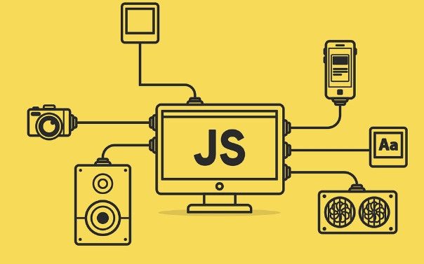

# JAVASCRIPT

## ¿Que es Javascript?

JavaScript es un lenguaje de programación de alto nivel que se utiliza principalmente para crear interactividad en páginas web. Es un lenguaje interpretado que se ejecuta en el navegador web del usuario, permitiendo a los desarrolladores crear aplicaciones web dinámicas y responsivas.



## FUNDAMENTOS DE JAVASCRIPT

Los fundamentos de JavaScript son los conceptos básicos que uno necesita comprender para comenzar a programar en este lenguaje.

## Metodos string

Los métodos de cadena,también conocidos como métodos de string,son funciones en JavaScript que se utilizan para realizar operaciones y manipulaciones en cadenas de texto.

```Javascript
let texto = "Hola Mundo";

// length 

console.log(texto.length); // Imprime 10 por la longitud de una candena

// toUpperCase

console.log(texto.toLocaleUpperCase()); // Vuelve en mayuscula el string en este caso "HOLA MUNDO"

// toLowerCase

console.log(texto.toLocaleLowerCase()); // Vuelve en minuscula el string en este caso "hola mundo"

// trim().length

let parrafo = "       Hola Mundo     " // trim() se utiliza para eliminar los espacios blancos al principio y al final 
console.log(parrafo.trim().length);
```

También existe la concatenación que es una operación fundamental en el manejo de cadenas de texto en JavaScript. La concatenación se refiere a la acción de unir dos o más cadenas para formar una cadena más larga.

```Javascript
// Concatenacion manual (ES5) Javascript antiguo
console.log('Bienvenido' + ' ' + name + ' ' + lastname + 'al bootcamp');

// Template string (ES6)
console.log(`Bienvenido ${name} ${lastname} al bootcamp`);
```

## NUMEROS Y OPERACIONES 

En JavaScript los números son un tipo de datos que se utilizan para representar valores numéricos,enteros o flotante (decimales). Puedes realizar operaciones matemáticas básicas con números en JavaScript,sumar,restar,multiplicar y dividir.

```Javascript
// Suma

let suma = 10 + 10;

// resta

let resta = 10 - 2;

// multiplicacion 

let multiplicacion = 15 * 2;

// division

let division = 20 / 5;

// modulo 

let modulo = 20 % 3;

// DATO NaN  (Not a Number)

let resultado = 10 / 'hola';
```

## INCREMENTALES

Los operadores de incremento en JavaScript se utilizan para aumentar el valor de una variable en una unidad.

```Javascript
let asignacion = 10;

// INCREMENTAL SUMA

asignacion++;

// INCREMENTAL RESTA

asignacion--;

// OPERADOR DE INCREMENTO CON ASIGNACION

asignacion += 3;

asignacion -= 2;

asignacion *= 4;

asignacion /= 2;
```

## OPERADORES DE COMPARACION

Los operadores de comparación en JavaScript se utilizan para comparar dos valores y devolver un valor booleano que indica si la comparación es verdadera o falsa.

```Javascript
//IGUALDAD 

let a = 5;
let b = '5';
console.log(a == b) // True porque 5 es igual que '5'

//IGUALDAD ESTRICTA 

let c = 10;
let d = '10';
console.log(c === d); // False porque 10 no es igual que '10' por el tipo de dato

//DESIGUALDAD 

let e = 20;
let f = '20';
console.log(e != f) // False porque 20 no es igual a '20'

// DESIGUALDAD ESTRICTA

let g = 5;
let h = '5';
console.log(g !== h); // True porque 5 no es igual a '5' por el tipo de dato

let user = 'Mauri'
let user2 = 'Pereda'

console.log(user !== user2) // True porque son diferentes.

//MAYOR (>) MAYOR O IGUAL (>=) MENOR QUE (<) MENOR O IGUAL (<=)

let i = 10;
let j = 5;
console.log(i > j); // TRUE
console.log(i >= j); // TRUE
console.log(i < j); // FALSE 
console.log(i <= j); // FALSE
```

## CONDICIONALES

Las estructuras condicionales en JavaScript son utilizadas para tomar decisiones en base a condiciones específicas. 

```Javascript
const username = 'Mauricio';
const password = '123456';
const email = false;

// if y else: Permite ejecutar un código si la condición es verdadera y el otro código si la condición es falsa.

if (username === 'Mauri'){
    console.log("Estas logeado");
} else {
    console.log("No estas logeado");
}

if (password === '123456'){
    console.log("Contraseña correcta");
} else {
    console.log("Contraseña incorrecta");
}

// else if: Se utiliza cuando tienes varias condiciones que verificar.

if (username === 'Mauri'){
    console.log("Estas logeado");
} else if (email){
    console.log("Estas logeado");
} else {
    console.log("No estas logeado");
}

// switch: Se utiliza para seleccionar uno de los múltiples bloques de código para ejecutar.

switch (email) {
    case true:
        console.log("El usuario ha proporcionado un email válido");
        break;
    case false:
        console.log("El usuario no ha proporcionado un email válido");
    default:
        console.log("El estado del email no esta definido");
}

// Operacion ternario: La operación ternaria se utiliza para asignar un mensaje a la variable mensaje dependiendo del valor de la variable

let edad = 18;
let mensaje = (edad >= 18) ? "eres mayor de edad" : "eres menor de edad";

console.log(mensaje);
```

## BOOLEANOS 

Los booleanos en JavaScript son un tipo de datos que pueden tener uno de dos valores: true o false

```Javascript
let diasoleado = true;
let dialluvioso = false;
let value = ''

if (value){
    console.log("ES VERDAD!"); // Aqui no se imprimira nada en la consola porque la variable 'value' se establece en una cadena vacia ' '' ' 
}

if(diasoleado) {
    console.log("ES UN DIA SOLEADO!"); // Como la variable 'Diasoleado' esta establecido en 'true' y siempre se ejecutara en if porque la condicional if es un si y else es un no,imprimiendo "ES UN DIA SOLEADO" pero si cambiamos el diaSoleado en False sera "NO ES UN DIA SOLEADO" 
}else {
    console.log("NO ES UN DIA SOLEADO");
}

if(dialluvioso) {
    console.log("ES UN DIA LLUVIOSO!"); // Al igual que diaSoleado solo que la variable dialluvioso esta en false. 
}else {
    console.log("NO ES UN DIA LLUVIOSO");
}
```

